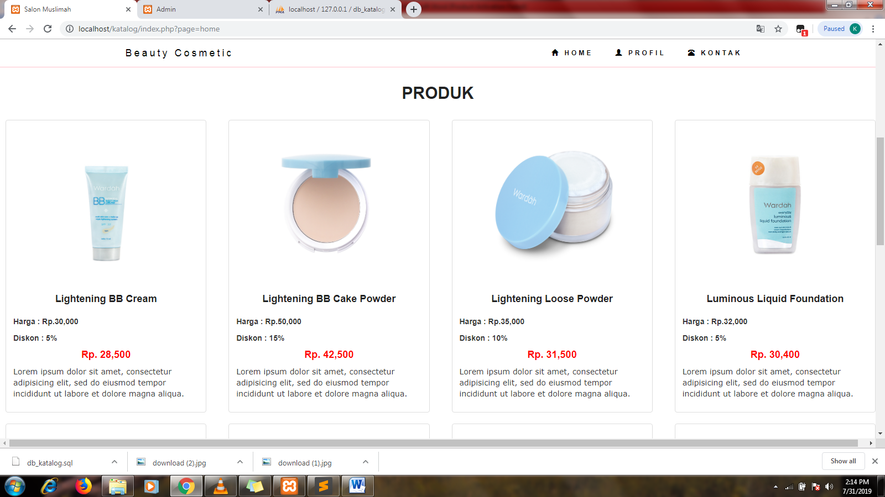
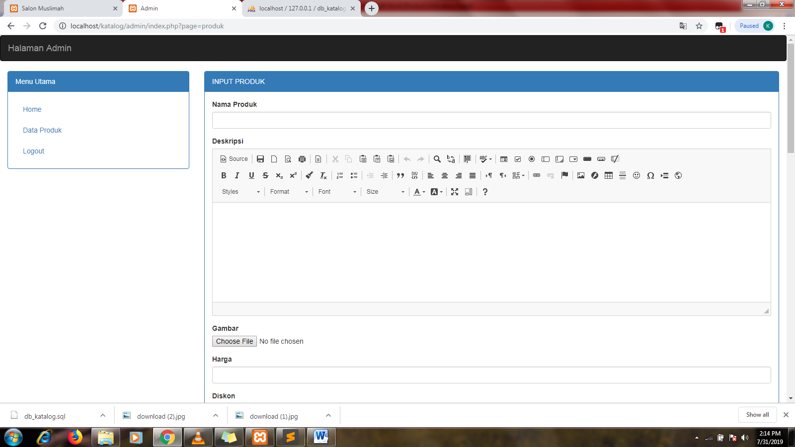
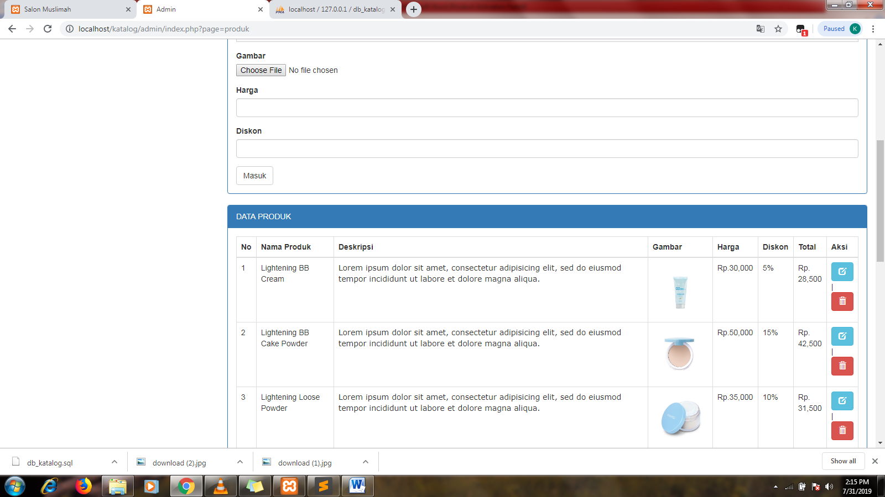

📄 README – Katalog

📌 Product Catalog System

A web-based application to display and manage product information, including product description, price, discount, and final price.

---

🚀 Features

🎓 Frontend (User)

* Homepage → display all products
* Profile page
* Contact page

🛠️ Backend (Admin)

* Admin login & logout
* Dashboard overview
* Manage Products (Add, Edit, Delete)

---

🛠️ Tech Stack

* **Programming Language**: PHP, HTML, CSS
* **Framework/Library**: Native PHP + Bootstrap
* **Database**: MySQL
* **Tools**: XAMPP (Apache, PHP, MySQL), phpMyAdmin, Sublime Text

---

📂 Project Structure

```plaintext
/product-catalog
 ┣ 📂 assets        # css, js
 ┣ 📂 gbrproduk     # images product
 ┣ 📂 admin         # dashboard, CRUD pages
 ┣ 📂 lib        
 ┣ 📂 module        
 ┣ 📂 phpfpdf        
 ┣ 📂 ss            # screenshoot images
 ┣ 📜 index.php     # landing page (homepage)
 ┣ 📜 README.md
 ┗ 📜 db_katalog.sql  # SQL file to import database
```

---

⚙️ Installation & Usage

1. Clone the repository

   ```bash
   git clone https://github.com/username/Katalog.git
   ```
2. Move project to XAMPP `htdocs` folder

   ```
   C:\xampp\htdocs\katalog
   ```
3. Import database

   * Open phpMyAdmin → Create new DB `db_katalog`
   * Import `db_katalog.sql`
4. Run project

   * Start Apache & MySQL in XAMPP
   * Open browser:

     * User view → [http://localhost/product-catalog/frontend](http://localhost/katalog)
     * Admin view → [http://localhost/product-catalog/admin](http://localhost/katalog/admin)
5. Default login (Admin)

   * Username: `admin`
   * Password: `admin`

---

📸 Screenshots

Screenshoot 1

Screenshoot 2

Screenshoot 3

Screenshoot 4


---

📈 Future Improvements

* Add shopping cart and checkout system
* Add user login/registration
* Apply discount rules automatically
* Deploy online with GitHub Pages/Heroku

---

💻 Author

**Rahma Eka Putri**

* 📧 Email: [rahmaputri552@gmail.com](mailto:rahmaputri552@gmail.com)
* 🌐 GitHub: [github.com/rahmaputri309](https://github.com/rahmaputri552)